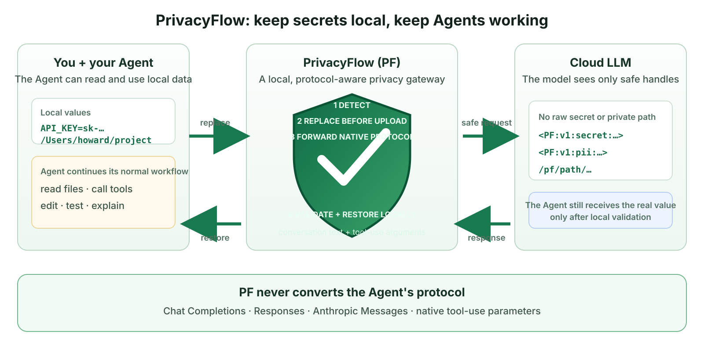

<p align="center">
  
</p>

<h1 align="center">PrivacyFlow</h1>

<p align="center">
  <strong>English</strong> · <a href="README_zh.md">简体中文</a>
</p>

<p align="center"><strong>Keep secrets local. Keep agents working.</strong></p>

<p align="center">
  A protocol-aware local privacy proxy for agents that use cloud LLMs.<br>
  Replace detected sensitive text before upload, then validate and restore handles in local response text and structured tool arguments.
</p>

<p align="center">
  <a href="https://github.com/HKUDS/PrivacyFlow/actions/workflows/ci.yml"></a>
  <a href="https://www.python.org/"></a>
  <a href="LICENSE"></a>
  
</p>

<p align="center">
  <a href="#-quick-start">Quick Start</a> ·
  <a href="#-how-it-works">How It Works</a> ·
  <a href="#-supported-api-formats">API Formats</a> ·
  <a href="#-security-boundary">Security</a> ·
  <a href="#-documentation">Docs</a>
</p>

<p align="center">
  
</p>

## Why PrivacyFlow?

When users rely on agents for real work, they often need those agents to read
`.env` files, logs, configuration, source code, and tool arguments. Sometimes,
they must directly provide the agent with API keys, passwords, personal
information, private paths, or other sensitive values for the task. These values
may be discovered by the agent or intentionally supplied by the user. Either way,
the goal is for the agent to use them, not for the cloud LLM behind it to receive
them in plaintext. Sending the original values to a cloud model means trusting
every provider and intermediary that handles the request. Data policies vary;
some services may retain or reuse requests for model improvement or training.
Unofficial or personal API relays make retention, access, and reuse even harder
to assess. Moving entirely to local models often means either investing
substantial compute resources or accepting less capable models.

### What providers say

Data use depends on the product, account type, and privacy settings. On several
consumer services, model-improvement data use remains enabled until the user
turns it off; some safety-review and feedback exceptions still apply after an
opt-out. The providers' own documentation also warns users not to submit
sensitive or confidential information.[^provider-defaults]

| Provider | Official policy |
| --- | --- |
| OpenAI | **ChatGPT and Codex content may be used for training unless the user opts out.** OpenAI also says not to share sensitive information in conversations. [Data-usage policy](https://help.openai.com/en/articles/5722486-api-data-usage-policies) · [ChatGPT privacy guidance](https://help.openai.com/en/articles/6783457-chatgpt-privacy-and-data-security) |
| Anthropic | Claude consumer chats and coding sessions may be used when Model Improvement is enabled, feedback is submitted, or a conversation is flagged for safety review; flagged conversations may still be used for internal safety-model training after the general setting is disabled. Anthropic explicitly says: **“We encourage our users not to use our products and services to process personal data.”** [Consumer policy](https://privacy.claude.com/en/articles/10023555-how-do-you-use-personal-data-in-model-training) · [Commercial policy](https://privacy.claude.com/en/articles/7996885-how-do-you-use-personal-data-in-model-training) |
| Google | **When Gemini Keep Activity is on, chats, files, screens, and photos may be used to improve services, including training generative AI models, with some data reviewed by humans.** Google warns users not to enter confidential information they would not want a reviewer to see or Google to use for improvement. Turning Keep Activity off prevents future chats from being used for general model training unless feedback is submitted, though chats are still retained for 72 hours for service and safety purposes. [Gemini Apps Privacy Hub](https://support.google.com/gemini/answer/13594961?hl=en) |
| DeepSeek | DeepSeek's privacy policy permits operational and statistical analysis of dialogue content to improve algorithmic models, service intelligence, and understanding of user input. Its user agreement separately tells users **not to enter their own or other people's sensitive personal information**; continuing to use the service constitutes acceptance of the policy rather than a separate training opt-in. [Privacy policy](https://platform.deepseek.com/downloads/DeepSeek%20Privacy%20Policy.pdf) · [User agreement](https://platform.deepseek.com/downloads/DeepSeek%20User%20Agreement.pdf) |

These policies do not mean that every provider trains on every request.
But the providers' own warnings make the practical boundary clear: users should
not assume that a cloud LLM is an appropriate place for plaintext personal data
or secrets. PrivacyFlow enforces that boundary locally instead of relying on every user,
agent, setting, and intermediary to handle sensitive values correctly.

### What users have reported

The following public reports have not been confirmed by the providers and do
not independently prove cross-user data leakage. Unexpected content may also
result from hallucination, context contamination, client bugs, or tool input.
They nevertheless illustrate a practical problem: once sensitive data is sent
upstream, users lose control over which systems process it and whether it might
reappear under unexpected conditions.

| Platform | Public report |
| --- | --- |
| Claude | After asking Claude to organize local files and run a Git command, a user received an unrelated comparison of layoff candidates containing roles, salaries, and skills. [View the original post](https://x.com/manateelazycat/status/2076933787217428652) |
| Claude Code | A user reported that unrelated production-server connection details and credentials appeared in a session, after which the Agent connected to the server and modified a third-party database. [View the issue](https://github.com/anthropics/claude-code/issues/72274) |
| ChatGPT | Multiple users reported receiving responses unrelated to files they had uploaded. One response allegedly contained a document uploaded by a local lawyer. [View the discussion](https://news.ycombinator.com/item?id=43615756) |
| Gemini | After uploading audio for transcription, a user received an unrelated business-meeting transcript containing names, corporate email addresses, contracts, and document links. The poster said some of the people and details could be verified. [View the original post](https://www.reddit.com/r/GeminiAI/comments/1v8700z/gemini_gave_me_someone_elses_transcript/) |

PrivacyFlow does not need to assume that every anomaly is a data breach. It replaces
values detected in supported textual fields before a request leaves the device.
If an upstream service experiences incorrect routing, logging, context
contamination, or another unexpected failure, those replaced values appear as
placeholders rather than their original literals.

Exposing a secret can also interrupt the task itself. A safety-aligned model may
warn the user to revoke a credential, refuse to continue, or avoid using the
value—even when the intended operation is legitimate. The user is then forced
to replace, paste, or manage sensitive values manually, adding friction and
more human-in-the-loop work.

PrivacyFlow keeps a detected literal value local and gives the model a stable
placeholder instead. The model only needs to know that a secret exists and
where it should be used; it rarely needs to know the secret itself. PrivacyFlow verifies
the handle and restores it in two protocol-defined response classes: ordinary
client-visible text and recognized structured tool-call arguments. These are
field classifications, not tool authorization or execution approval.

| Detect locally | Protect before upload | Restore locally |
| --- | --- | --- |
| Credentials, PII, and local paths in scanned text fields | Signed placeholders and stable path aliases replace detected values | Verified values reappear in client-visible answers and recognized structured tool arguments |

PrivacyFlow uses one fixed built-in detection pipeline for traffic. It combines
deterministic credential and personal-information rules with local-path detection,
then applies the fixed placeholder and streaming safety layers. The WebUI and
management API do not expose detector presets, custom configurations, module
editing or ordering, dry runs, or per-detector failure-mode settings. Local model
management remains available for preparing local model artifacts, but it does not
attach a model to this pipeline.

### What makes PrivacyFlow different

- **Transparent protection** — the model works with stable placeholders; the
  local Agent client receives validated values back without manually decoding them.
- **Local control plane** — provider credentials are configured locally and
  used only for upstream authentication rather than returned to the Agent;
  mappings, fixed detector state, audit records, and optional models stay on
  the machine.
- **Defense against placeholder spoofing** — materialization checks signature,
  session, workspace, mapping state, expiry, revocation, and response-field class.
- **Inspectable behavior** — review protected mappings and audit every
  replacement and restoration without storing raw values in logs.

## 🛡️ How it works

PrivacyFlow handles both directions locally. Before a request leaves the device, it
walks supported textual JSON fields, detects sensitive values, and replaces
them with signed placeholders or stable path aliases. When the model response
returns, PrivacyFlow treats ordinary response text as `local_user` and recognized
structured tool-call argument fields as `local_tool`, validates handles, and
restores their local mappings before returning the response to the Agent. These
labels describe protocol locations; PrivacyFlow does not approve or execute the tool.

Given this local input:

```text
Email alice@example.test, open /Users/alice/private/project,
and use key sk-example-not-a-real-key.
```

the model sees:

```text
Email <PF:v1:pii:...>, open /workspace/project-hash,
and use key <PF:v1:secret:...>.
```

After the model returns the placeholders, the client-visible local result is:

```text
Email alice@example.test, open /Users/alice/private/project,
and use key sk-example-not-a-real-key.
```

If the model needs a protected value, it keeps the placeholder unchanged. PrivacyFlow
verifies the placeholder and restores the original in ordinary local response
text or a recognized decoded structured tool argument. A later request is
scanned again before it can reach the model.

This contract covers supported textual JSON and SSE fields. Protocol identifiers
and opaque multimodal payload fields such as `image_url`, `file_data`, audio, and
image blocks are deliberately passed through unchanged to avoid corrupting the
wire format. PrivacyFlow therefore does not claim complete request-wide or multimodal
data-loss prevention.

## ⚡ Quick Start

> **Fast path: connect your Agent in one click.** Once PrivacyFlow is running and an
> upstream is enabled, open **Agent quick connect**, choose a model, and click
> **Quick connect**. PrivacyFlow detects your installed Codex, Claude Code, DeepSeek
> Harness, or nanobot, validates its native protocol, and writes the user-level
> configuration for you—no manual endpoint or key copying. The change can be
> undone at any time with **Restore previous configuration**.

### 1. Install

Requirements: Python 3.11 or newer on macOS, Linux, or Windows.

```bash
git clone https://github.com/HKUDS/PrivacyFlow.git
cd PrivacyFlow

python3 -m venv .venv
. .venv/bin/activate
python -m pip install -e .
```

On Windows PowerShell, activate the environment with
`.venv\Scripts\Activate.ps1`.

### 2. Start PrivacyFlow

```bash
privacyflow
```

The first start creates `.privacyflow/launcher.json`, a random local Agent API key, and
a signing secret. PrivacyFlow prints its loopback WebUI:

```text
PrivacyFlow
WebUI: http://127.0.0.1:8765/ui/
```

### 3. Connect an upstream

Open the WebUI and:

1. add a named upstream configuration;
2. enter the provider Base URL and API key;
3. save and enable the configuration;
4. turn on the PrivacyFlow master switch.

Provider keys are written to the local launcher configuration with mode `0600`
where supported and are never returned by the management API.
Every connection exposes the Chat Completions, Responses, and Anthropic Messages
entrypoints by default. PrivacyFlow selects the matching native upstream route from the
incoming endpoint and never converts between formats. If the provider does not
support that format, PrivacyFlow returns the actual upstream error.

### 4. Connect an Agent to PrivacyFlow

The WebUI's **Agent quick connect** view configures installed Codex, Claude Code,
DeepSeek Harness, and nanobot user-level instances. PrivacyFlow refreshes the upstream
model catalog and performs a real probe using the Agent's native protocol before
writing any file. DeepSeek Harness uses endpoint configuration; PrivacyFlow does not
install a native dsh plugin.

Each Agent receives a dedicated local key. PrivacyFlow snapshots complete configuration
files before connection. **Restore previous configuration** writes back the exact
original bytes and permissions, or removes a file that did not previously exist.
If a target already contains a reserved provider, preset, or environment key,
the first attempt lists the affected paths and asks for explicit migration
confirmation. PrivacyFlow only replaces the files after confirmation, and saves the
complete pre-connect snapshot first; cancel leaves the configuration untouched.
If a file changed after connection, PrivacyFlow requires confirmation and saves the
current version as a safety backup first.

The Overview connection strip remains available for manually connecting other
Agents with PrivacyFlow's Base URL and primary local API key.

Copy the Base URL and generated local API key from **Agent connection** in the
WebUI. Select the model in the Agent itself—PrivacyFlow deliberately does not own model
selection.

| Agent request format | PrivacyFlow Base URL |
| --- | --- |
| OpenAI Chat Completions | `http://127.0.0.1:8765/v1` |
| OpenAI Responses | `http://127.0.0.1:8765/v1` |
| Anthropic Messages | `http://127.0.0.1:8765` |

> [!NOTE]
> PrivacyFlow does not convert between Chat Completions, Responses, and Anthropic
> Messages. The Agent and upstream must support the same request format. To
> manage and quickly switch connection profiles across different Agents and
> model providers, consider using [CC Switch](https://github.com/farion1231/cc-switch)
> alongside PrivacyFlow. CC Switch manages configurations; it is not PrivacyFlow's protocol
> conversion layer.

The repository-level `./privacyflow` wrapper is available for development
checkouts. The old `apg` command remains a migration-release compatibility alias.

If an existing installation still uses `.apg/`, run `privacyflow migrate` once.
It copies the launcher, database, audit log, detector state, local-model state,
and Agent connector transactions into `.privacyflow/`, verifies the copy, and
normalizes any stale legacy detector editor state to the fixed built-in pipeline.
The original `.apg/` tree is kept as a read-only `.apg.legacy/<timestamp>/`
backup, including the untouched legacy detector file. Migration never edits shell
startup files. During this release, `APG_*` environment variables, legacy
`X-APG-*` headers, and `<APG:v1:...>` placeholders remain readable; `PF_*`,
`X-PF-*`, and `<PF:v1:...>` are the canonical forms.

## 🔌 Supported API formats

PrivacyFlow accepts three API formats:

| Format | Local endpoint |
| --- | --- |
| OpenAI Chat Completions | `POST /v1/chat/completions` |
| OpenAI Responses | `POST /v1/responses` |
| Anthropic Messages | `POST /v1/messages` |

PrivacyFlow forwards each request in its original API format and does not translate it
into another protocol.

## ✨ Features

### Protection pipeline

- one fixed built-in pipeline for credentials, API keys, personal information,
  local paths, and stable workspace aliases;
- session-bound signed placeholders and lifecycle-aware mappings;
- streaming-safe replacement and restoration;
- structured tool-argument materialization;
- fixed handling for detector and placeholder failures.

Risk levels are audit metadata. They do not change how protected data is
replaced; enforcement remains in the policy, mapping, placeholder, and
materialization layers. A detector finding whose suggested action is `block`
is currently replaced like other secret findings; it does not reject the whole
upstream request.

### Control and observability

- one-click PrivacyFlow master switch;
- multiple named upstream configurations;
- all three native API entrypoints on every upstream configuration;
- random local Agent API-key generation;
- bilingual English/Chinese WebUI;
- one fixed built-in protection pipeline with a global PrivacyFlow switch;
- protected-value review, revocation, and retention controls;
- replacement and restoration audit views;
- responsive desktop and mobile management UI.

### Optional local models

The **Local model management** page accepts a Hugging Face repository/URL or an
existing local directory. **Add and prepare** performs:

```text
inspect → prepare isolated runtime → download → real inference verification
```

PrivacyFlow does not install PyTorch into its own environment. It creates a versioned
runtime under `.privacyflow/runtimes/`, stores managed model data under `.privacyflow/models/`,
and communicates with a local worker over private JSON Lines. Remote custom code
is disabled, and local model directories remain read-only.

## 🔒 Security boundary

PrivacyFlow protects detected values in supported textual fields of traffic that
actually passes through PrivacyFlow. Its scope is intentionally narrower than a DLP,
sandbox, or endpoint security product.

| PrivacyFlow does | PrivacyFlow does not |
| --- | --- |
| Detect and replace sensitive values before upstream transmission | Stop an Agent process from reading local files directly |
| Let Agent clients use a local key instead of the provider key, and never return provider keys in management responses | Approve tool calls or control the Agent's permissions |
| Validate signed placeholders before local restoration | Control destinations contacted by locally executed tools |
| Keep mappings, configuration, models, and audit state local | Replace a secrets manager, network policy, EDR, or OS sandbox |
| Record sanitized replacement/restoration operations | Make a remotely exposed management endpoint safe |

Scanning is limited to supported textual protocol fields. Opaque multimodal
payloads and protocol identifiers pass through unchanged. Structured tool-call
arguments are classified by their response shape; PrivacyFlow does not verify that the
named tool is local, permitted, or safe before restoring a valid handle.

The management API and WebUI intentionally have **no application-layer
authentication**. They must remain loopback-only. Never publish port `8765`,
reverse-proxy the management routes, or bind PrivacyFlow to an untrusted network.

A prompt-injected model can still request a local tool call that sends a
materialized secret to an attacker. The Agent harness must gate tool execution
and outbound destinations.

Read the full [design and threat model](docs/design.md),
[WebUI security notes](docs/webui.md), and [security policy](SECURITY.md).

## ⚙️ Configuration and local state

The WebUI is the recommended configuration path.

<details>
<summary><strong>Advanced environment configuration</strong></summary>

```bash
export PF_UPSTREAM_API_KEY='provider-key'
export PF_UPSTREAM_BASE_URL='https://api.openai.com'
export PF_UPSTREAM_PROTOCOL='openai_chat_completions'
export PF_SIGNING_SECRET='long-random-local-secret'
export PF_LOCAL_API_KEYS='long-random-agent-key'
export PF_PORT=8765
```

`PF_UPSTREAM_PROTOCOL` accepts:

- `openai_chat_completions`
- `openai_responses`
- `anthropic_messages`

Useful optional settings:

```bash
export PF_ADMIN_ENABLED=true
export PF_PII_MODE='pseudonymize'  # pseudonymize, redact, or allow
export PF_GC_INTERVAL_SECONDS=60
```

See [`config/example_policy.yaml`](config/example_policy.yaml) for policy
settings.

</details>

Local state defaults to `.privacyflow/`:

| Path | Contents |
| --- | --- |
| `launcher.json` | Named upstream profiles, provider keys, local Agent key |
| `state.sqlite3` | Protected-value mappings and operation records |
| `audit.jsonl` | Sanitized append-only audit events |
| `detector-control.json` | Internal fixed-pipeline state and global protection toggle; stale legacy editor data is normalized or ignored |
| `local-models.json` | Local-model catalog and validation state |
| `models/` | PrivacyFlow-managed Hugging Face cache |
| `runtimes/` | Isolated model runtime |

Secret-bearing files are created with restrictive permissions where supported.
Provider keys and active mapping values are stored locally in plaintext rather
than encrypted by PrivacyFlow. Place the state directory on encrypted storage and
restrict access to the PrivacyFlow process user.

## ✅ Validation

The main branch keeps the standard regression suite:

| Layer | Purpose | Command or evidence |
| --- | --- | --- |
| Unit and API regression | Proxy, detector, mapping, stream, UI, and security behavior | `pytest -m 'not integration'` |
| Networked local-model integration | Isolated runtime download and real Worker inference | `PF_RUN_LOCAL_MODEL_INTEGRATION=1 pytest -m integration tests/test_local_models_integration.py` |

## 📚 Documentation

| Start here | What it covers |
| --- | --- |
| [`docs/design.md`](docs/design.md) | Architecture, trust boundaries, placeholders, and materialization |
| [`docs/webui.md`](docs/webui.md) | Management behavior, persistence, raw-value review, and UI security |
| [`docs/threat_model.md`](docs/threat_model.md) | Threats, mitigations, assumptions, and residual risk |
| [`docs/harness_integration.md`](docs/harness_integration.md) | Agent and tool-harness integration |
| [`docs/roadmap.md`](docs/roadmap.md) | Planned work and open design areas |

## Development

```bash
python3 -m venv .venv
. .venv/bin/activate
python -m pip install -e '.[dev]'

pytest -m 'not integration'
node --check src/gateway/webui/app.js
node --check src/gateway/webui/i18n.js
ruff check .
```

Networked local-model integration is intentionally excluded from normal tests:

```bash
PF_RUN_LOCAL_MODEL_INTEGRATION=1 pytest -m integration \
  tests/test_local_models_integration.py
```

## Project layout

| Path | Purpose |
| --- | --- |
| [`src/gateway/`](src/gateway/) | Gateway, detection, storage, proxy, model worker, and WebUI |
| [`tests/`](tests/) | Unit, API, stream, security, and WebUI regression tests |
| [`docs/`](docs/) | Design, operations, threat model, and validation evidence |
| [`examples/`](examples/) | Minimal client and security examples |

## Contributing

Contributions are welcome. Start with [`CONTRIBUTING.md`](CONTRIBUTING.md), read
the [`CODE_OF_CONDUCT.md`](CODE_OF_CONDUCT.md), and open an issue before large
architectural or API contract changes.

Please never include real credentials, protected values, private paths, or
unsanitized Agent transcripts in issues or pull requests.

## License

PrivacyFlow is licensed under the
[Apache License 2.0](LICENSE). Bundled third-party notices are kept under
[`docs/vendor/`](docs/vendor/).

[^provider-defaults]: Business and API products often have stronger default data policies than consumer products. Refer to the terms for the specific provider, product, and account.
