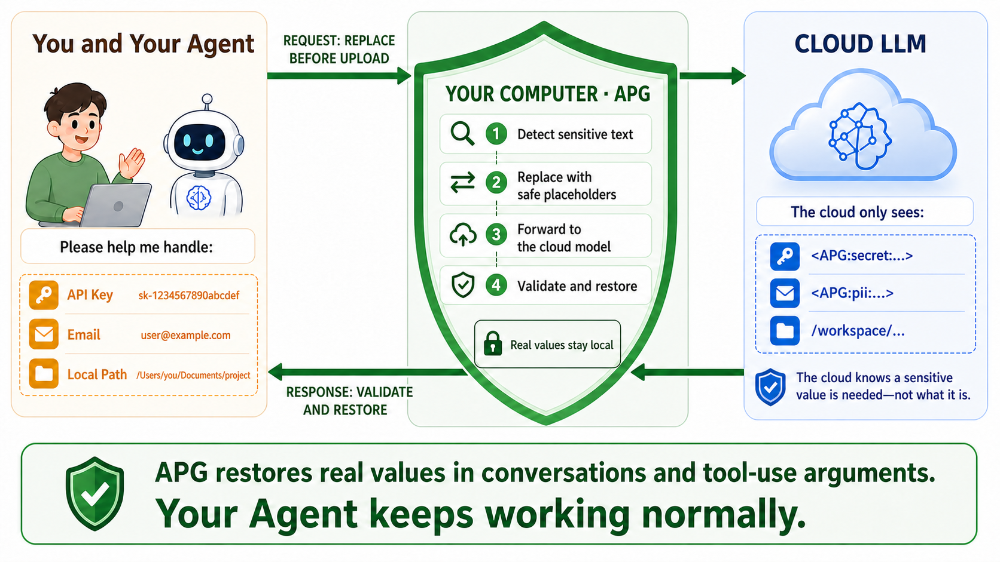

<p align="center">
  
</p>

<h1 align="center">Agent Privacy Gateway</h1>

<p align="center">
  <a href="README.md">English</a> · <strong>简体中文</strong>
</p>

<p align="center"><strong>让敏感信息留在本地，让 Agent 正常工作。</strong></p>

<p align="center">面向云端 LLM Agent 的协议感知本地隐私代理。<br>上传前替换文本字段中检测到的敏感值，在本地可见回复和结构化工具参数中验证并还原 Handle。</p>

<p align="center">
  <a href="https://github.com/HKUDS/Agent-Privacy-Gateway/actions/workflows/ci.yml"></a>
  <a href="https://www.python.org/"></a>
  <a href="LICENSE"></a>
  
</p>

<p align="center">
  <a href="#quick-start">快速开始</a> ·
  <a href="#how-it-works">工作原理</a> ·
  <a href="#api-formats">API 格式</a> ·
  <a href="#security">安全边界</a> ·
  <a href="#documentation">文档</a>
</p>

<p align="center">
  
</p>

## 为什么需要 APG？

用户在让 Agent 处理真实任务时，经常需要它读取 `.env`、日志、配置文件、源代码和工具参数，或者直接把 API Key、密码、个人信息、私有路径等敏感值交给它使用。这些值既可能由 Agent 在执行任务时发现，也可能由用户主动提供；但用户希望的是让 Agent 完成任务，而不是让背后的云端 LLM 接触这些原值。把原值直接发给云端模型，意味着必须信任请求链路上的模型供应商和所有中间服务。不同服务的数据政策并不相同，部分服务会留存请求，甚至将其用于模型改进或训练；如果使用来路不明的个人中转站，用户往往更难判断自己的数据最终去了哪里、由谁访问以及会被如何利用。而完全转向本地模型，往往意味着投入大量计算资源，或接受能力更弱的模型。

### 提供商自己的说明

数据如何使用取决于具体产品、账户类型和隐私设置。部分消费级服务会持续使用数据改进模型，直到用户主动关闭相关设置；即使已经退出，安全审查和反馈等情况仍可能例外。各提供商的官方文档也明确提醒用户不要提交敏感或机密信息。[^provider-defaults]

| 提供商 | 官方说明 |
| --- | --- |
| OpenAI | **ChatGPT 和 Codex 中的内容可能被用于训练，除非用户主动退出。** OpenAI 还明确提醒用户不要在对话中分享敏感信息。[数据使用政策](https://help.openai.com/en/articles/5722486-api-data-usage-policies) · [ChatGPT 隐私说明](https://help.openai.com/en/articles/6783457-chatgpt-privacy-and-data-security) |
| Anthropic | Claude 消费级产品中的聊天和编程会话可能在开启模型改进、提交反馈或被标记进行安全审查时使用；即使关闭常规模型改进设置，被标记的会话仍可能用于内部安全模型训练。Anthropic 明确表示：**“我们建议用户不要使用我们的产品和服务处理个人数据。”** [消费级产品政策](https://privacy.claude.com/en/articles/10023555-how-do-you-use-personal-data-in-model-training) · [商业产品政策](https://privacy.claude.com/en/articles/7996885-how-do-you-use-personal-data-in-model-training) |
| Google | **开启 Gemini Keep Activity 后，聊天、文件、屏幕和照片可能被用于改进服务，包括训练生成式 AI 模型，部分数据还可能由人工审查。** Google 明确提醒用户不要输入不希望审查人员看到或被用于改进服务的机密信息。关闭 Keep Activity 后，未来聊天通常不再用于模型训练，但提交反馈时除外；这些聊天仍会为提供服务和保障安全而保留 72 小时。[Gemini Apps 隐私中心](https://support.google.com/gemini/answer/13594961?hl=zh-Hans) |
| DeepSeek | DeepSeek 的隐私政策允许对对话内容进行运营和统计分析，以改进算法模型、服务智能以及对用户输入的理解。其用户协议另行要求用户**不要输入自己或他人的敏感个人信息**；继续使用服务即表示接受相关政策，而不是另行选择是否允许训练。[隐私政策](https://platform.deepseek.com/downloads/DeepSeek%20Privacy%20Policy.pdf) · [用户协议](https://platform.deepseek.com/downloads/DeepSeek%20User%20Agreement.pdf) |

这些政策并不表示所有提供商都会训练每一条请求。但提供商自己的警告已经说明了实际边界：用户不应假设云端 LLM 适合接收明文个人数据或密钥。APG 在本地强制落实这条边界，而不是依赖每个用户、Agent、隐私设置和中间服务都能正确处理敏感值。

### 用户已经报告了什么

下面这些公开报告尚未得到服务商确认，不能单独证明发生了跨用户数据泄漏。异常内容也可能来自模型幻觉、上下文污染、客户端故障或工具输入。但它们反映了一个现实问题：敏感信息一旦被发送到上游，用户就无法继续控制它经过哪些系统，以及是否会在异常情况下再次出现。

| 平台 | 公开报告 |
| --- | --- |
| Claude | 用户让 Claude 整理本地文件并执行 Git 命令后，Claude 突然生成了与当前任务无关的裁员候选人比较，其中包含岗位、薪资和技能等信息。[查看原帖](https://x.com/manateelazycat/status/2076933787217428652) |
| Claude Code | 用户报告称，会话中突然出现了陌生生产服务器的连接信息和凭据，随后 Agent 连接该服务器并修改了第三方数据库。[查看 Issue](https://github.com/anthropics/claude-code/issues/72274) |
| ChatGPT | 多名用户表示，上传自己的文件后收到了明显与文件无关的答复；其中一份内容疑似来自当地律师上传的文档。[查看讨论](https://news.ycombinator.com/item?id=43615756) |
| Gemini | 用户上传音频进行转录后，Gemini 返回了一场无关商业会议的内容，其中包含姓名、公司邮箱、合同和文档链接。发帖者称部分人物和信息可以被核实。[查看原帖](https://www.reddit.com/r/GeminiAI/comments/1v8700z/gemini_gave_me_someone_elses_transcript/) |

APG 不需要假设每一次异常都是数据泄漏。它会在请求离开设备前替换受支持文本字段中检测到的敏感值：即使上游发生错误路由、日志留存、上下文污染或其他不可预期的问题，这些已替换的值也只会以占位符出现，而不是暴露原始字面值。

直接暴露密钥还可能妨碍任务进行。经过安全对齐的模型可能要求用户撤销密钥、拒绝继续处理，或刻意避开这些值，即使用户的操作本身完全合理。用户只能手动替换、复制或管理敏感数据，增加操作成本，也让本应自动完成的流程重新依赖人工介入。

APG 把检测到的原值留在本地，只向模型提供稳定的占位符。模型通常只需要知道“这里有一个密钥”以及“应该在哪里使用它”，并不需要知道密钥的具体内容。APG 会验证 Handle，并在两类协议位置恢复映射：返回给本地 Agent 客户端的普通回复文本，以及识别出的结构化工具调用参数。这是字段分类，不是工具授权或执行审批。

| 本地检测 | 上传前保护 | 本地还原 |
| --- | --- | --- |
| 检测文本字段中的凭据、个人信息、本地路径和可选高熵值 | 使用签名占位符和稳定路径别名替换检测结果 | 在客户端可见答案和识别出的结构化工具参数中还原通过验证的值 |

### APG 有什么不同

- **无感保护**——模型使用稳定的占位符继续工作，本地 Agent 客户端无需手动解码即可获得通过验证的原值。
- **本地控制平面**——供应商凭据在本地配置，只用于上游鉴权而不会返回给 Agent；受保护值映射、检测器配置、审计记录和可选模型保存在本机。
- **防止伪造占位符**——还原前会验证签名、会话、工作区、映射状态、有效期、撤销状态和响应字段类别。
- **行为可检查**——可以试跑检测器、查看受保护映射，并在不把原值写入日志的前提下审计每次替换与还原。

<a id="how-it-works"></a>

## 🛡️ 工作原理

APG 在本地处理请求和响应两个方向。请求离开设备前，APG 会遍历受支持的 JSON 文本字段，将检测到的敏感值替换为签名占位符或稳定路径别名。模型响应返回后，APG 把普通回复文本归类为 `local_user`，把识别出的结构化工具调用参数归类为 `local_tool`，验证 Handle 后再把本地映射恢复到返回给 Agent 的响应中。这两个名称描述协议位置；APG 不审批或执行工具。

以下本地输入：

```text
Email alice@example.test, open /Users/alice/private/project,
and use key sk-example-not-a-real-key.
```

模型看到的是：

```text
Email <APG:v1:pii:...>, open /workspace/project-hash,
and use key <APG:v1:secret:...>.
```

模型返回占位符后，客户端可见的本地结果为：

```text
Email alice@example.test, open /Users/alice/private/project,
and use key sk-example-not-a-real-key.
```

如果模型需要使用受保护值，它只需原样保留占位符。APG 会验证该占位符，并在普通本地回复文本或识别出的、完成解码的结构化工具参数中恢复原值。后续请求仍会在发往模型前重新扫描。

这份契约只覆盖受支持的 JSON/SSE 文本字段。为避免破坏协议，`image_url`、`file_data`、音频、图片块等不透明多模态字段以及协议标识符会原样通过。因此 APG 目前不是覆盖整个请求或多模态数据的完整 DLP。

<a id="quick-start"></a>

## ⚡ 快速开始

> **最快路径：一键接入 Agent。** APG 启动并启用上游配置后，打开 WebUI 的
> **Agent 快速接入**，选择模型并点击 **快速接入**。APG 会自动检测已经安装的
> Codex、Claude Code、DeepSeek Harness 或 nanobot，预检原生协议并写入用户级配置，
> 无需手动复制 endpoint 或 API Key；之后可随时点击 **恢复原配置** 撤销接入。

### 1. 安装

要求：macOS、Linux 或 Windows，以及 Python 3.11 或更高版本。

```bash
git clone https://github.com/HKUDS/Agent-Privacy-Gateway.git
cd Agent-Privacy-Gateway

python3 -m venv .venv
. .venv/bin/activate
python -m pip install -e .
```

在 Windows PowerShell 中，请使用 `.venv\Scripts\Activate.ps1` 激活环境。

### 2. 启动 APG

```bash
apg
```

首次启动会创建 `.apg/launcher.json`、随机本地 Agent API Key 和签名密钥。APG 会打印 loopback WebUI 地址：

```text
Agent Privacy Gateway
WebUI: http://127.0.0.1:8765/ui/
```

### 3. 连接上游模型

打开 WebUI，然后：

1. 新增一个具名上游配置；
2. 填写供应商 Base URL 和 API Key；
3. 保存并启用该配置；
4. 打开 APG 总开关。

在支持文件权限的系统中，供应商密钥会以 `0600` 权限写入本地启动配置；管理 API 永远不会返回供应商密钥。
每个连接默认开放 Chat Completions、Responses 和 Anthropic Messages 三种入口。APG 根据收到请求的本地端点选择匹配的原生上游端点，不会在格式之间转换；如果供应商不支持该格式，APG 会返回实际上游错误。

### 4. 将 Agent 接入 APG

WebUI 的 **Agent 快速接入**页面可自动配置已经安装的 Codex、Claude Code、DeepSeek Harness 和 nanobot。选择模型后，APG 会重新读取上游模型目录，并用该 Agent 的原生协议进行真实测试；只有测试成功才会写入用户级配置。DeepSeek Harness 使用 endpoint 配置，不安装原生插件。

每个 Agent 使用独立的本地 Key。接入前的配置文件会被完整快照；点击 **恢复原配置** 后按原始字节和权限还原，原本不存在的文件会被删除。如果目标配置中已经存在相关的 provider、preset 或环境变量，首次接入会先列出文件路径并要求明确确认迁移；确认后才会先保存完整快照再覆盖，取消不会修改任何文件。如果文件在接入后被修改，APG 会先要求确认并保存当前版本的安全备份。

概览页仍提供 Base URL 和主本地 API Key，便于手动接入其他 Agent。

| Agent 请求格式 | APG Base URL |
| --- | --- |
| OpenAI Chat Completions | `http://127.0.0.1:8765/v1` |
| OpenAI Responses | `http://127.0.0.1:8765/v1` |
| Anthropic Messages | `http://127.0.0.1:8765` |

> [!NOTE]
> APG 不会在 Chat Completions、Responses 和 Anthropic Messages 之间转换协议，Agent 与上游必须支持相同的请求格式。快速接入只管理模型 endpoint、模型名和本地凭据，不扩大 APG 的安全边界：工具权限、工具执行和本地会话日志仍由 Agent 负责。

在开发检出目录中也可以使用仓库根目录下的 `./apg` 包装脚本。安装后的环境应使用 `apg` 命令。

<a id="api-formats"></a>

## 🔌 支持的 API 格式

APG 支持三种 API 格式：

| 格式 | 本地端点 |
| --- | --- |
| OpenAI Chat Completions | `POST /v1/chat/completions` |
| OpenAI Responses | `POST /v1/responses` |
| Anthropic Messages | `POST /v1/messages` |

APG 始终按请求原有的 API 格式转发，不会将其转换成另一种协议。

## ✨ 功能

### 保护流水线

- 确定性的凭据和 API Key 规则；
- 确定性的个人信息规则；
- 本地路径检测和稳定工作区别名；
- 可选的熵值与上下文启发式检测；
- 可选的本地小模型检测；
- 会话绑定的签名占位符和带生命周期的映射；
- 对流式传输安全的替换与还原；
- 结构化工具参数还原；
- 标明每项发现来源模块的检测器试跑；
- 检测器失败时可配置 fail-open 或 fail-close。

风险等级仅用于审计元数据，不会改变受保护数据的替换方式。实际强制执行发生在策略、映射、占位符和还原层，而不是由模型置信度决定。检测结果中的 `block` 当前仍会像其他 Secret 一样被替换，不会拒绝整个上游请求。

### 控制与可观测性

- 一键 APG 总开关；
- 多个具名上游配置；
- 随机本地 Agent API Key 生成；
- 中英文双语 WebUI；
- 检测器预设、排序、启停、复制和高级设置；
- 受保护值查看、撤销和保留策略；
- 替换与还原审计视图；
- 支持桌面与移动端的响应式管理界面。

### 可选本地模型

**本地模型管理**页面接受 Hugging Face 仓库/URL 或已有的本地模型目录。点击**添加并准备**会依次执行：

```text
检查 → 准备隔离运行环境 → 下载 → 真实推理验证
```

APG 不会把 PyTorch 安装到自己的运行环境中。它会在 `.apg/runtimes/` 创建版本化环境，将受管模型数据保存在 `.apg/models/`，并通过私有 JSON Lines 协议与本地 Worker 通信。远程自定义代码始终禁用，本地模型目录对 APG 保持只读。

<a id="security"></a>

## 🔒 安全边界

APG 保护确实经过它、且位于受支持文本字段中的检测结果。它有意采用比完整 DLP、沙箱或端点安全产品更窄的职责范围。

| APG 会做 | APG 不会做 |
| --- | --- |
| 在发送上游前检测并替换配置范围内的敏感值 | 阻止 Agent 进程直接读取本地文件 |
| 让 Agent 客户端使用本地 Key，而无需持有供应商 Key；管理响应也不会返回供应商 Key | 审批工具调用或控制 Agent 权限 |
| 在本地还原前验证签名占位符 | 控制本地工具访问的网络目标 |
| 将映射、配置、模型和审计状态保存在本地 | 取代密钥管理器、网络策略、EDR 或操作系统沙箱 |
| 记录经过脱敏的替换和还原操作 | 让暴露到远程的管理端点变得安全 |

扫描范围仅限受支持的协议文本字段；不透明多模态载荷和协议标识符会原样通过。结构化工具参数按响应形状分类，APG 在恢复有效 Handle 前不会验证相应工具是否位于本地、是否获得授权或是否安全。

管理 API 和 WebUI 有意**不设置应用层身份验证**，因此必须仅限 loopback 访问。切勿公开端口 `8765`、反向代理管理路由，或将 APG 绑定到不可信网络。

遭受提示注入的模型仍可能请求本地工具把已还原的敏感值发送给攻击者。Agent 运行框架必须自行限制工具执行和出站目标。

请阅读完整的[设计与威胁模型](docs/design.md)、[WebUI 安全说明](docs/webui.md)和[安全政策](SECURITY.md)。

## ⚙️ 配置与本地状态

推荐通过 WebUI 完成配置。

<details>
<summary><strong>高级环境变量配置</strong></summary>

```bash
export APG_UPSTREAM_API_KEY='provider-key'
export APG_UPSTREAM_BASE_URL='https://api.openai.com'
export APG_UPSTREAM_PROTOCOL='openai_chat_completions'
export APG_SIGNING_SECRET='long-random-local-secret'
export APG_LOCAL_API_KEYS='long-random-agent-key'
export APG_PORT=8765
```

`APG_UPSTREAM_PROTOCOL` 接受：

- `openai_chat_completions`
- `openai_responses`
- `anthropic_messages`

常用可选设置：

```bash
export APG_ADMIN_ENABLED=true
export APG_PII_MODE='pseudonymize'  # pseudonymize、redact 或 allow
export APG_GC_INTERVAL_SECONDS=60
```

策略配置请参考 [`config/example_policy.yaml`](config/example_policy.yaml)。

</details>

本地状态默认保存在 `.apg/`：

| 路径 | 内容 |
| --- | --- |
| `launcher.json` | 具名上游配置、供应商 Key、本地 Agent Key |
| `state.sqlite3` | 受保护值映射和操作记录 |
| `audit.jsonl` | 仅追加的脱敏审计事件 |
| `detector-control.json` | 检测器配置 |
| `local-models.json` | 本地模型目录和验证状态 |
| `models/` | APG 管理的 Hugging Face 缓存 |
| `runtimes/` | 隔离模型运行环境 |

在支持文件权限的系统中，包含敏感信息的文件会使用严格权限创建。供应商 Key 和活动映射原值由 APG 以本地明文保存，而不是由 APG 加密。请将状态目录放在加密存储上，并限制为只有 APG 进程用户可以访问。

## ✅ 验证

主分支保留标准回归测试：

| 层级 | 目的 | 命令或证据 |
| --- | --- | --- |
| 单元与 API 回归 | 验证代理、检测器、映射、流式传输、WebUI 与安全行为 | `pytest -m 'not integration'` |
| 联网本地模型集成 | 验证隔离运行环境下载和真实 Worker 推理 | `APG_RUN_LOCAL_MODEL_INTEGRATION=1 pytest -m integration tests/test_local_models_integration.py` |

<a id="documentation"></a>

## 📚 文档

| 从这里开始 | 内容 |
| --- | --- |
| [`docs/design.md`](docs/design.md) | 架构、信任边界、占位符和还原 |
| [`docs/webui.md`](docs/webui.md) | 管理行为、持久化、原值查看和 UI 安全 |
| [`docs/threat_model.md`](docs/threat_model.md) | 威胁、缓解措施、假设和残余风险 |
| [`docs/harness_integration.md`](docs/harness_integration.md) | Agent 与工具运行框架接入 |
| [`docs/roadmap.md`](docs/roadmap.md) | 计划工作和待定设计 |

## 开发

```bash
python3 -m venv .venv
. .venv/bin/activate
python -m pip install -e '.[dev]'

pytest -m 'not integration'
node --check src/gateway/webui/app.js
node --check src/gateway/webui/i18n.js
ruff check .
```

联网的本地模型集成测试有意排除在普通测试之外：

```bash
APG_RUN_LOCAL_MODEL_INTEGRATION=1 pytest -m integration \
  tests/test_local_models_integration.py
```

## 项目结构

| 路径 | 用途 |
| --- | --- |
| [`src/gateway/`](src/gateway/) | 网关、检测、存储、代理、模型 Worker 和 WebUI |
| [`tests/`](tests/) | 单元、API、流式传输、安全和 WebUI 回归测试 |
| [`docs/`](docs/) | 设计、运行、威胁模型和验证证据 |
| [`examples/`](examples/) | 最小客户端与安全示例 |

## 参与贡献

欢迎贡献。请先阅读 [`CONTRIBUTING.md`](CONTRIBUTING.md) 和 [`CODE_OF_CONDUCT.md`](CODE_OF_CONDUCT.md)，大型架构或协议变更请先提交 issue。

请勿在 issue 或 pull request 中包含真实凭据、受保护值、私有路径或未经脱敏的 Agent 对话记录。

## 许可证

Agent Privacy Gateway 使用 [Apache License 2.0](LICENSE)。第三方依赖声明保存在 [`docs/vendor/`](docs/vendor/)。

[^provider-defaults]: 商业版和 API 产品通常比消费级产品采用更严格的默认数据政策，具体以相应提供商、产品和账户条款为准。
