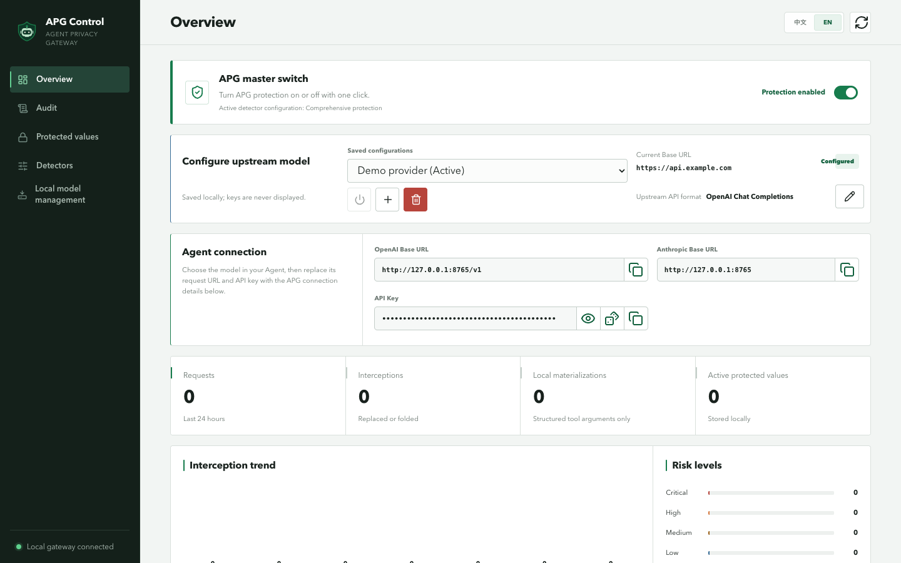
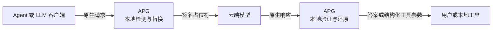

<p align="center">
  
</p>

<h1 align="center">Agent Privacy Gateway</h1>

<p align="center">
  <a href="README.md">English</a> · <strong>简体中文</strong>
</p>

<p align="center"><strong>让敏感信息留在本地，让 Agent 正常工作。</strong></p>

<p align="center">
  面向云端编程 Agent 和 LLM 客户端的本地隐私边界。<br>
  在请求离开设备前检测并替换敏感值，只在经授权的本地出口还原原值。
</p>

<p align="center">
  <a href="https://github.com/zzhtx258/Agent-Privacy-Gateway/actions/workflows/ci.yml"></a>
  <a href="https://www.python.org/"></a>
  <a href="LICENSE"></a>
  
</p>

<p align="center">
  <a href="#quick-start">快速开始</a> ·
  <a href="#how-it-works">工作原理</a> ·
  <a href="#protocols">协议支持</a> ·
  <a href="#security">安全边界</a> ·
  <a href="#documentation">文档</a>
</p>

<p align="center">
  
</p>

> [!IMPORTANT]
> APG 目前仍处于 1.0 之前的 Alpha 阶段。请始终将管理界面限制在
> loopback，阅读[安全边界](#security)，并先使用自己的 Agent 工作流进行测试，
> 再接入生产凭据。

## 为什么需要 APG？

编程 Agent 经常需要读取 `.env`、日志、配置文件、源代码、本地路径和工具参数。
完全禁止这些上下文会显著降低 Agent 的能力，而把所有原始值发送给云端模型又会
造成不必要的数据暴露。

APG 在 Agent 与模型之间建立一道本地边界：

| 本地检测 | 上传前保护 | 保持原生协议 | 本地还原 |
| --- | --- | --- | --- |
| 检测凭据、个人信息、本地路径和高熵值 | 使用签名占位符和稳定路径别名替换原值 | Chat Completions、Responses 与 Anthropic Messages 始终是独立的传输格式 | 仅在本地答案和结构化工具参数中还原通过验证的值 |

### APG 有什么不同

- **无感保护**——模型使用稳定的占位符继续工作，用户无需手动解码即可在本地看到
  经授权还原的原值。
- **原生输入，原生输出**——APG 不在不同 API 格式之间转换请求、响应、流式事件、
  工具调用或供应商错误。
- **本地控制平面**——供应商凭据、受保护值映射、检测器配置、审计记录和可选模型
  均保存在本机。
- **防止伪造占位符**——还原前会验证签名、会话、工作区、映射状态、有效期、
  撤销状态和目标出口。
- **行为可检查**——可以试跑检测器、查看受保护映射，并在不把原值写入日志的
  前提下审计每次替换与还原。
- **面向真实 Agent 验证**——仓库包含确定性测试，以及带明确泄漏断言的
  Claude Code/OpenCode 真实矩阵。

<a id="how-it-works"></a>

## 🛡️ 工作原理



以下本地输入：

```text
Email alice@example.test, open /Users/alice/private/project,
and use key sk-example-not-a-real-key.
```

模型看到的是：

```text
Email <APG:v1:pii:...>, open /workspace/project-hash,
and use key <APG:v1:secret:...>.
```

如果模型需要使用受保护值，它只需原样保留占位符。APG 会验证该占位符，并仅在
经授权的本地响应或解码后的结构化工具参数中还原原值。原始值不会被还原到
上游或模型可见的流量中。

无效、被修改、已过期、已撤销或跨会话使用的占位符都会以 fail-closed 方式处理。

<a id="quick-start"></a>

## ⚡ 快速开始

### 1. 安装

要求：macOS、Linux 或 Windows，以及 Python 3.11 或更高版本。

```bash
git clone https://github.com/zzhtx258/Agent-Privacy-Gateway.git
cd Agent-Privacy-Gateway

python3 -m venv .venv
. .venv/bin/activate
python -m pip install -e .
```

在 Windows PowerShell 中，请使用 `.venv\Scripts\Activate.ps1` 激活环境。

### 2. 启动 APG

```bash
apg
```

首次启动会创建 `.apg/launcher.json`、随机本地 Agent API Key 和签名密钥。
APG 会打印 loopback WebUI 地址：

```text
Agent Privacy Gateway
WebUI: http://127.0.0.1:8765/ui/
```

### 3. 连接上游模型

打开 WebUI，然后：

1. 新增一个具名上游配置；
2. 选择它实际使用的 API 格式；
3. 填写供应商 Base URL 和 API Key；
4. 保存并启用该配置；
5. 打开 APG 总开关。

在支持文件权限的系统中，供应商密钥会以 `0600` 权限写入本地启动配置；
管理 API 永远不会返回供应商密钥。

### 4. 将 Agent 指向 APG

从 WebUI 的 **Agent 接入**区域复制 Base URL 和自动生成的本地 API Key。
模型仍然由用户在 Agent 中选择——APG 不负责决定 Agent 使用哪个模型。

| Agent 请求格式 | APG Base URL |
| --- | --- |
| OpenAI Chat Completions | `http://127.0.0.1:8765/v1` |
| OpenAI Responses | `http://127.0.0.1:8765/v1` |
| Anthropic Messages | `http://127.0.0.1:8765` |

> [!CAUTION]
> Agent 的请求格式必须与当前启用的上游格式完全一致。APG 不会在
> Chat Completions、Responses 和 Anthropic Messages 之间进行转换。

在开发检出目录中也可以使用仓库根目录下的 `./apg` 包装脚本。安装后的环境
应使用 `apg` 命令。

<a id="protocols"></a>

## 🔌 原生协议支持

APG 有意将三种支持的格式完全分开：

| 格式 | 本地端点 | 上游请求 | 流式事件与错误 |
| --- | --- | --- | --- |
| OpenAI Chat Completions | `POST /v1/chat/completions` | Chat Completions JSON | 保持 Chat Completions SSE 与错误格式 |
| OpenAI Responses | `POST /v1/responses` | Responses JSON | 保持 Responses 事件与错误格式 |
| Anthropic Messages | `POST /v1/messages` | Anthropic Messages JSON | 保持 Anthropic 事件与错误格式 |

这样可以避免在消息角色、内容块、推理字段、工具调用表示、用量信息、结束原因、
事件类型和供应商特有错误之间进行有损映射。

## ✨ 功能

### 保护流水线

- 确定性的凭据和 API Key 规则；
- 确定性的个人信息规则；
- 本地路径检测和稳定工作区别名；
- 可选的熵值与上下文启发式检测；
- 可选的本地小模型检测；
- 会话绑定的签名占位符和带生命周期的映射；
- 对流式传输安全的替换与还原；
- 结构化工具参数还原；
- 标明每项发现来源模块的检测器试跑；
- 检测器失败时可配置 fail-open 或 fail-close。

风险等级仅用于审计元数据，不会改变受保护数据的替换方式。实际强制执行发生在
策略、映射、占位符和还原层，而不是由模型置信度决定。

### 控制与可观测性

- 一键 APG 总开关；
- 多个具名上游配置；
- 随机本地 Agent API Key 生成；
- 中英文双语 WebUI；
- 检测器预设、排序、启停、复制和高级设置；
- 受保护值查看、撤销和保留策略；
- 替换与还原审计视图；
- 仓库内经过脱敏的真实 Agent 验证证据；
- 支持桌面与移动端的响应式管理界面。

### 可选本地模型

**本地模型管理**页面接受 Hugging Face 仓库/URL 或已有的本地模型目录。
点击**添加并准备**会依次执行：

```text
检查 → 准备隔离运行环境 → 下载 → 真实推理验证
```

APG 不会把 PyTorch 安装到自己的运行环境中。它会在 `.apg/runtimes/`
创建版本化环境，将受管模型数据保存在 `.apg/models/`，并通过私有 JSON Lines
协议与本地 Worker 通信。远程自定义代码始终禁用，本地模型目录对 APG 保持只读。

<a id="security"></a>

## 🔒 安全边界

APG 只保护确实经过 APG 的流量。它有意采用比沙箱或端点安全产品更窄的职责范围。

| APG 会做 | APG 不会做 |
| --- | --- |
| 在发送上游前检测并替换配置范围内的敏感值 | 阻止 Agent 进程直接读取本地文件 |
| 让 Agent 客户端使用本地 Key，而无需持有供应商 Key；管理响应也不会返回供应商 Key | 审批工具调用或控制 Agent 权限 |
| 在本地还原前验证签名占位符 | 控制本地工具访问的网络目标 |
| 将映射、配置、模型和审计状态保存在本地 | 取代密钥管理器、网络策略、EDR 或操作系统沙箱 |
| 记录经过脱敏的替换和还原操作 | 让暴露到远程的管理端点变得安全 |

管理 API 和 WebUI 有意**不设置应用层身份验证**，因此必须仅限 loopback 访问。
切勿公开端口 `8765`、反向代理管理路由，或将 APG 绑定到不可信网络。

遭受提示注入的模型仍可能请求本地工具把已还原的敏感值发送给攻击者。Agent
运行框架必须自行限制工具执行和出站目标。

请阅读完整的[设计与威胁模型](docs/design.md)、
[WebUI 安全说明](docs/webui.md)和[安全政策](SECURITY.md)。

## ⚙️ 配置与本地状态

推荐通过 WebUI 完成配置。

<details>
<summary><strong>高级环境变量配置</strong></summary>

```bash
export APG_UPSTREAM_API_KEY='provider-key'
export APG_UPSTREAM_BASE_URL='https://api.openai.com'
export APG_UPSTREAM_PROTOCOL='openai_chat_completions'
export APG_SIGNING_SECRET='long-random-local-secret'
export APG_LOCAL_API_KEYS='long-random-agent-key'
export APG_PORT=8765
```

`APG_UPSTREAM_PROTOCOL` 接受：

- `openai_chat_completions`
- `openai_responses`
- `anthropic_messages`

常用可选设置：

```bash
export APG_ADMIN_ENABLED=true
export APG_PII_MODE='pseudonymize'  # pseudonymize、redact 或 allow
export APG_GC_INTERVAL_SECONDS=60
```

策略配置请参考 [`config/example_policy.yaml`](config/example_policy.yaml)。

</details>

本地状态默认保存在 `.apg/`：

| 路径 | 内容 |
| --- | --- |
| `launcher.json` | 具名上游配置、供应商 Key、本地 Agent Key |
| `state.sqlite3` | 受保护值映射和操作记录 |
| `audit.jsonl` | 仅追加的脱敏审计事件 |
| `detector-control.json` | 检测器配置 |
| `local-models.json` | 本地模型目录和验证状态 |
| `models/` | APG 管理的 Hugging Face 缓存 |
| `runtimes/` | 隔离模型运行环境 |

在支持文件权限的系统中，包含敏感信息的文件会使用严格权限创建。请将状态目录
放在加密存储上，并限制为只有 APG 进程用户可以访问。

## ✅ 验证

主分支保留标准回归测试：

| 层级 | 目的 | 命令或证据 |
| --- | --- | --- |
| 单元与 API 回归 | 验证代理、检测器、映射、流式传输、WebUI 与安全行为 | `pytest -m 'not integration'` |
| 联网本地模型集成 | 验证隔离运行环境下载和真实 Worker 推理 | `APG_RUN_LOCAL_MODEL_INTEGRATION=1 pytest -m integration tests/test_local_models_integration.py` |

确定性 E2E、Claude Code/OpenCode 真实矩阵、泄漏断言和脱敏证据统一维护在
[`dev` 分支](https://github.com/zzhtx258/Agent-Privacy-Gateway/tree/dev/e2e_agent_tests)。
真实测试需要明确启用，并会消耗供应商容量。

<a id="documentation"></a>

## 📚 文档

| 从这里开始 | 内容 |
| --- | --- |
| [`docs/design.md`](docs/design.md) | 架构、信任边界、占位符和还原 |
| [`docs/webui.md`](docs/webui.md) | 管理行为、持久化、原值查看和 UI 安全 |
| [`docs/threat_model.md`](docs/threat_model.md) | 威胁、缓解措施、假设和残余风险 |
| [`docs/harness_integration.md`](docs/harness_integration.md) | Agent 与工具运行框架接入 |
| [`dev` 验证套件](https://github.com/zzhtx258/Agent-Privacy-Gateway/tree/dev/e2e_agent_tests) | 确定性 E2E 和真实 Agent 矩阵 |
| [`dev` 验证证据](https://github.com/zzhtx258/Agent-Privacy-Gateway/blob/dev/docs/live_validation_results.md) | 经过脱敏的真实 Agent 验证结果 |
| [`docs/roadmap.md`](docs/roadmap.md) | 计划工作和待定设计 |

## 开发

```bash
python3 -m venv .venv
. .venv/bin/activate
python -m pip install -e '.[dev]'

pytest -m 'not integration'
node --check src/gateway/webui/app.js
node --check src/gateway/webui/i18n.js
ruff check .
```

联网的本地模型集成测试有意排除在普通测试之外：

```bash
APG_RUN_LOCAL_MODEL_INTEGRATION=1 pytest -m integration \
  tests/test_local_models_integration.py
```

## 项目结构

| 路径 | 用途 |
| --- | --- |
| [`src/gateway/`](src/gateway/) | 网关、检测、存储、代理、模型 Worker 和 WebUI |
| [`tests/`](tests/) | 单元、API、流式传输、安全和 WebUI 回归测试 |
| [`docs/`](docs/) | 设计、运行、威胁模型和验证证据 |
| [`examples/`](examples/) | 最小客户端与安全示例 |

## 参与贡献

欢迎贡献。请先阅读 [`CONTRIBUTING.md`](CONTRIBUTING.md) 和
[`CODE_OF_CONDUCT.md`](CODE_OF_CONDUCT.md)，大型架构或协议变更请先提交 issue。

请勿在 issue 或 pull request 中包含真实凭据、受保护值、私有路径或未经脱敏的
Agent 对话记录。

## 许可证

Agent Privacy Gateway 使用 [Apache License 2.0](LICENSE)。
第三方依赖声明保存在 [`docs/vendor/`](docs/vendor/)。
